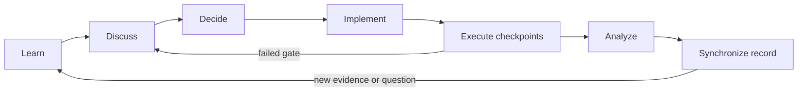

# Research workflow and record policy

This file defines how a simulation moves from an idea to an academic claim.
The sequence is mandatory for SIM-02 and later stages.

## Lifecycle

### 1. Learn

- Query the project graph and read the smallest set of authoritative sources.
- Separate literature facts, repository measurements, and inherited drafts.
- Record unresolved scientific and software questions.

### 2. Discuss

- Compare feasible methods, artifacts, cost, and failure modes.
- Identify which choices affect the scientific interpretation.
- Keep proposed values labeled `[OPEN]` or `[TO TEST]` until decided.

### 3. Decide

- Create a dated `research/decisions/DECISION-*.md` record.
- State the decision, evidence, alternatives, reason, and approval status.
- Supersede an earlier assumption through a later record; do not rewrite history.

### 4. Implement

- Create traceable inputs, analysis code, metadata, and run commands.
- Record engine versions, packages, seeds, units, and parameter provenance.
- Add no hidden manual transformation.

### 5. Execute through checkpoints

Run only as far as the next checkpoint:

1. syntax/package availability;
2. system construction and count/density verification;
3. minimization and constraint validation;
4. equilibrium validation against SIM-01-compatible quantities;
5. short eHEX stability and energy-conservation pilot;
6. steady-state pilot with spatial profiles;
7. production only after the pilot acceptance criteria pass.

Failed attempts are evidence. Preserve their inputs and record the failure in
`history/` rather than deleting the story.

### 6. Analyze

- Establish stationarity before averaging production data.
- Use time blocks, not individual frames, as uncertainty units unless justified.
- Keep profile sign, coordinate origin, folding, units, and normalization explicit.
- Report a signal comparable to its uncertainty as unresolved.

### 7. Synchronize the record

At every meaningful checkpoint, update all affected artifacts:

| Artifact | Required content |
|---|---|
| Run README | commands, inputs, environment, checkpoint outcome, next action |
| Marimo notebook | executable analysis, figures, tables, and visible missing-data states |
| Research book | chronological academic narrative, evidence class, interpretation, limitations |
| Technical report | final frozen methods and measured results for the completed checkpoint |
| Decision log | choices and superseded assumptions |
| Media narrative | story beats linked to real evidence and visuals |
| `PROJECT_STATE.md` | compact current state and next decision |
| Graphify | refreshed semantic map of changed research records |

## Source of truth

Raw output and versioned analysis code are the evidence source. The report and
research book interpret that evidence. The notebook makes the analysis visible.
The README explains reproduction. The video narrative communicates the same
timeline but cannot introduce a claim absent from the academic records.

## Claim vocabulary

- `[ESTABLISHED]`: directly supported by literature, documentation, or an
  inspected environment fact.
- `[MEASURED]`: produced from preserved project output by a documented method.
- `[INFERRED]`: reasoned interpretation of established or measured evidence.
- `[HYPOTHESIS]`: possible mechanism not distinguished by current evidence.
- `[OPEN]`: unresolved choice or question.
- `[TO TEST]`: a specified future check.

Every figure caption and substantive conclusion should make its evidence class
clear in surrounding text.

## Academic timeline

Use the date an event occurred, not the date the story was later written. When
an exact date is unavailable, say so. Preserve engine pivots and failed methods;
they explain why the final protocol is scientifically defensible.
